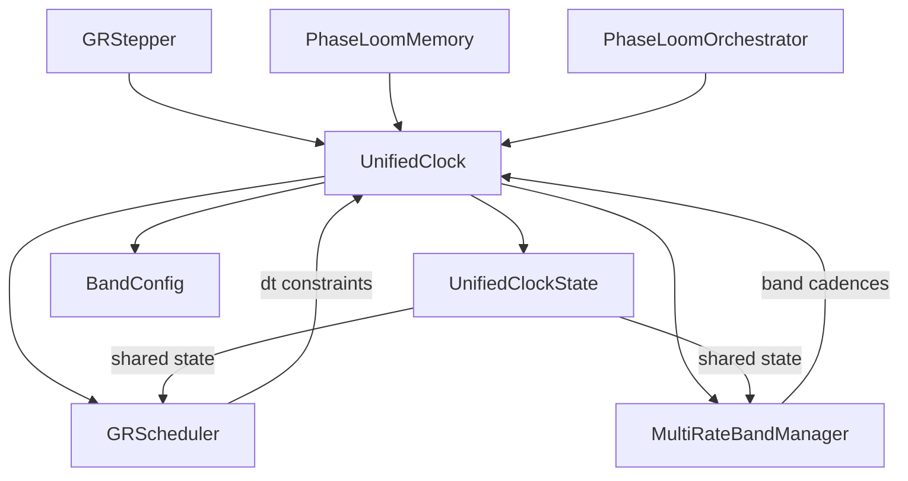

# Time Scale System Canvas v6.X

**Unified Canvas covering Levels 1–6 (single document, audit-ready, no placeholders)**
**Theme:** *Time is a governed resource, not a passive scalar.* Each level adds capability without invalidating earlier ones.
**Updated:** Reflects new UnifiedClock architecture (`gr_solver/gr_clock.py`)

---

## 0) Global Definitions and Notation

### 0.1 State and evolution (UFE/LoC-compatible)

Let (\\(\Psi(t)\\)) be the full system state (fields + solver state + symbolic state if present). The canonical evolution form:
\[
\partial_t \Psi = B(\Psi;\theta) + \lambda K(\Psi;\theta),
\]

* (B): baseline dynamics (physics, symbolic rules, plant model, etc.)
* (K): coherence feedback / rails operator (stabilization, projection, suppression, gating)
* (\\(\lambda\\)): coherence authority (strength / coupling)
* (\\(\theta\\)): parameters (physical constants, control gains, solver tolerances, etc.)

A discrete time stepper produces:
\[
\Psi^{n+1}=\Phi_{\Delta t}(\Psi^n;\theta).
\]

### 0.2 Diagnostics and margins

Diagnostics map:
\[
d = \mathcal D(\Psi^n,\Psi^{n+1};\theta)
\]
Margins are signed "safety proofs":
\[
m_i = \text{(allowable)}-\text{(observed)}.
\]
Safe if (\\(m_i\\ge 0\\)). Violated if (\\(m_i<0\\)).

Worst margin:
\[
m_*=\min_i m_i.
\]

### 0.3 Coherence time(s)

* Physical time: (\\(t\\in\\mathbb R_{\\ge 0}\\))
* Coherence time: (\\(\\tau\\in\\mathbb R_{\\ge 0}\\)) (Level 3+)
* Per-clock coherence times: (\\(\\tau_\\alpha\\)) (Level 5)

### 0.4 Coherence-time governor (generic)

\[
\Delta\tau = h(C,\Delta t),
\]
where (C) is a vector of diagnostics/margins and (h) is an admissible rate map:

* bounded: (\\(0\\le h(C)\\le h_{\\max}\\))
* monotone in safety margins (more safe ⇒ no slower)
* deterministic

### 0.5 UnifiedClock Architecture (Level 6+)

**New in v6.X:** Unified clock architecture provides single source of truth for time state.

#### 0.5.1 Core Classes

* **[`UnifiedClockState`](gr_solver/gr_clock.py:21)**: Shared state container with global_step, global_time, band_steps, band_times. Single source of truth for all clock operations.
* **[`UnifiedClock`](gr_solver/gr_clock.py:119)**: Main interface for clock operations. Used by GRScheduler and MultiRateBandManager.
* **[`BandConfig`](gr_solver/gr_clock.py:70)**: Configuration for per-band update cadences (octave-based).

#### 0.5.2 Architecture Diagram



#### 0.5.3 Key Properties

* **Thread-safe state**: UnifiedClockState is mutable but accessed sequentially in solver loop
* **Band-aware updates**: Higher octaves update less frequently (power-of-2 cadence factors)
* **Regime detection**: Cache invalidation on dt change (>2x), residual slope sign change, dominant band change
* **Snapshot/restore**: Full state serialization for checkpoint and rollback

---

## 1) Level 1 — Single-Rate Fixed-Step Time

### 1.1 Contract

Choose a constant step size (\\(\Delta t\\)) and evolve:
\[
t_{n+1}=t_n+\Delta t,\qquad \Psi^{n+1}=\Phi_{\Delta t}(\Psi^n).
\]

### 1.2 Stability requirement (must be *assumed or proven*)

A fixed-step scheme only makes sense if you can guarantee that chosen (\\(\Delta t\\)) is stable for the entire run. In practice you assume bounds like:

* CFL-like bound (advection):
  \[
  \Delta t \\le C_{\\text{CFL}}\\frac{\\Delta x}{|u|_\\infty}
  \]
* diffusion bound:
  \[
  \\Delta t \\le C_\\nu \\frac{\\Delta x^2}{\\nu}
  \]

### 1.3 Receipts (minimal)

Even Level 1 can log:

* (\\(t_n, \\Delta t\\))
* basic invariants / residual norms (if available)

**Limitation:** no responsiveness to changing stiffness; no governance beyond initial choice.

---

## 2) Level 2 — Adaptive Single-Clock Time (Classic "Adaptive Timestepper")

### 2.1 Contract

A single dominant clock controls dt, typically CFL or an error estimator:
\[
\\Delta t_{n} = \\mathrm{clip}\\big(\\Delta t_{\\text{clock}}(\\Psi^n),\\Delta t_{\\min},\\Delta t_{\\max}\\big).
\]
Then advance:
\[
t_{n+1}=t_n+\\Delta t_n,\\qquad \\Psi^{n+1}=\\Phi_{\\Delta t_n}(\\Psi^n).
\]

### 2.2 Typical dt clock examples

* CFL clock:
  \[
  \\Delta t_{\\text{adv}}(\\Psi)=C_{\\text{CFL}}\\frac{\\Delta x}{|u|_\\infty}
  \]
* diffusion clock:
  \[
  \\Delta t_{\\nu}(\\Psi)=C_\\nu\\frac{\\Delta x^2}{\\nu}
  \]
* local truncation error (LTE) controller (embedded RK):
  \[
  \\Delta t_{n+1}=\\Delta t_n\\left(\\frac{\\text{tol}}{\\text{err}_n}\\right)^{1/(p+1)}
  \]

### 2.3 Receipts (recommended)

* chosen clock name
* dt value
* error estimate / CFL number
* key diagnostics

**Limitation:** one clock tyrannizes all physics/symbolics. Coupled multi-physics becomes fragile.

---

## 3) Level 3 — Multi-Clock Governance + Rails + Rollback + Coherence Time

**This is where time becomes a protocol.**

### 3.1 Clocks as step bounds

Let (\\(\mathcal C\\)) be a set of clocks. Each clock returns an admissible upper bound:
\[
\\Delta t_\\alpha = \\Delta t_\\alpha(\\Psi^n,\\text{grid},\\theta).
\]
Raw proposal:
\[
\\Delta t_{\\text{raw}}=\\min_{\\alpha\\in\\mathcal C}\\Delta t_\\alpha.
\]
Apply caps:
\[
\\Delta t=\\mathrm{clip}(\\Delta t_{\\text{raw}},\\Delta t_{\\min},\\Delta t_{\\max}).
\]

### 3.2 Three clock classes

**Physical clocks:** advection, diffusion, forcing stiffness, wave speeds, chemistry stiffness.
**Numerical clocks:** aliasing controls, nonlinear transfer steepness, solver stability restrictions.
**Coherence clocks:** residual closure, energy drift, divergence constraints, tail barriers, symbolic rewrite budgets.

### 3.3 Coherence time (\\(\tau\\))

Coherence time advances according to margins:
\[
\\Delta\\tau = h(C,\\Delta t)
\]
with (C) derived from margins (or directly (\\(m_*\\))).

A canonical auditable (h) (piecewise linear):
\[
h(m_*)=
\\begin{cases}
0, & m_*<0\\\\
h_0 \\cdot m_*, & 0\\le m_*\\le m_{\\text{sat}}\\\\
h_{\\max}, & m_*\\ge m_{\\text{sat}}.
\\end{cases}
\]

### 3.4 Rails and rollback (deterministic)

Trial step → compute diagnostics → evaluate margins.
If any margin violated, rollback:
\[
\\Delta t\\leftarrow \\gamma\\Delta t,\\qquad 0<\\gamma<1,
\]
retry up to `max_rollbacks`. If exceeded, freeze/stop per policy (later refined in Level 4/5).

### 3.5 Braid/PhaseLoom metric (Level 3 form)

Each clock has a characteristic frequency (\\(\omega_\\alpha\\)). A dt induces phase increments:
\[
\\phi_\\alpha=\\omega_\\alpha \\Delta t.
\]
A simple braid coherence metric:
\[
q_P = 1-\\mathrm{Var}(\\mathrm{wrap}(\\phi_\\alpha))/\\pi^2 \\in [0,1].
\]
Use (\\(q_P\\)) to penalize (h) or to trigger rollback.

### 3.6 Extreme-\\(\\lambda\\) dominance safeguard

Define dominance:
\[
D_\\lambda(\\Psi)=\\frac{|\\lambda|\\cdot|K(\\Psi)|}{|B(\\Psi)|+\\varepsilon}.
\]
Regimes:

* (\\(D_\\lambda\\ll 1\\)): physics-dominated
* (\\(D_\\lambda\\sim 1\\)): blended
* (\\(D_\\lambda\\gg 1\\)): rail/projection-dominated

Level 3 typically clamps dt if (\\(D_\\lambda\\)) too large.

### 3.7 Receipts (Ω-ledger style)

Per step log:

* (\\(t_n,\\Delta t_n,\\tau_n,\\Delta\\tau_n\\))
* all (\\(\Delta t_\\alpha\\)) and the limiting clock
* margins (\\(m_i\\)), worst margin (\\(m_*\\))
* residual RMS, energy drift, divergence error
* braid (\\(q_P\\)), dominance (\\(D_\\lambda\\))
* rollback_count, status

---

## 4) Level 4 — Symbolic + Differentiable Clocks, Constraint Objects, Sensitivity-Aware dt Solving

Level 4 upgrades "dt bounds" into **constraint functions** and replaces shrink loops with **1D constrained optimization** plus derivative-aware root-finding.

### 4.1 Clocks become constraints

Each clock (\\(\alpha\\)) produces constraints:
\[
g_{\\alpha,i}(\\Delta t;\\Psi^n,\\theta)\\ge 0.
\]
Global feasibility margin:
\[
m(\\Delta t)=\\min_{\\alpha,i} g_{\\alpha,i}(\\Delta t).
\]
The chosen dt is the **largest feasible dt**:
\[
\\Delta t^\\star=\\max\\{\\Delta t\\in[\\Delta t_{\\min},\\Delta t_{\\max}]: m(\\Delta t)\\ge 0\\}.
\]

### 4.2 Predictive vs verificative constraints (explicit split)

* Predictive constraints (pre-trial, cheap): (\\(g^{\\text{pred}}(\\Delta t;\\Psi^n)\\))
* Verificative constraints (post-trial): (\\(g^{\\text{ver}}(\\Delta t;\\Psi^n,\\Psi^{n+1},d)\\))

This eliminates wasted implicit solves: if predictive infeasible, skip trial.

### 4.3 Canonical constraint forms (examples)

**CFL:**
\[
g_{\\text{adv}}(\\Delta t)=C_{\\text{CFL}}\\Delta t - \\frac{|u|_\\infty \\Delta t}{\\Delta x} \\le 0
\]
**Diffusion:**
\[
g_{\\nu}(\\Delta t)=C_\\nu \\Delta t - \\frac{\\nu \\Delta t}{\\Delta x^2} \\le 0
\]
**Residual closure (verificative):**
\[
g_{\\text{res}}(\\Delta t)=\\varepsilon_{\\max}-\\varepsilon(\\Delta t),\\quad \\varepsilon(\\Delta t)=|\\varepsilon^h_{\\text{UFE}}|_{\\text{rms}}.
\]
**Energy drift (verificative):**
\[
g_E(\\Delta t)=\\delta_E(\\Delta t)-|\\Delta E(\\Delta t)|.
\]
**Dyadic tail barrier (NSE-style):**
\[
g_{\\text{tail},j}(\\Delta t)=c_*-\\frac{\\Pi_j(\\Delta t)}{D_{\\ge j}(\\Delta t)},\\qquad
g_{\\text{tail}}(\\Delta t)=\\min_{j\\ge j_0} g_{\\text{tail},j}(\\Delta t).
\]
**Symbolic rewrite budget (predictive):**
\[
g_{\\text{rw}}(\\Delta t)=R_{\\max}-\\Delta t \\cdot r_{\\text{rw}}(\\Psi^n).
\]

### 4.4 Sensitivities (\\(\\partial_{\\Delta t}g\\))

* Analytic for linear clocks (CFL/diffusion/rewrite).
* For verificative diagnostics, use:

  * **secant derivative** (always works):
    \[
    g'(\\Delta t)\\approx \\frac{g(\\Delta t)-g(\\Delta t_{\\text{prev}})}{\\Delta t-\\Delta t_{\\text{prev}}}
    \]
  * or implicit differentiation if using an implicit solve:
    \[
    R(\\Psi^{n+1},\\Delta t)=0
    \\Rightarrow
    \\frac{d\\Psi^{n+1}}{d\\Delta t}=-(\\partial_\\Psi R)^{-1}\\partial_{\\Delta t}R
    \]
    then chain into diagnostic derivatives.

### 4.5 Feasible dt computation (deterministic)

Compute (\\(\\Delta t^\\star\\)) by bracketing + safeguarded Newton/secant on (\\(m(\\Delta t)=0\\)):

* ensure (\\(m(\\Delta t_{\\min})\\ge 0\\)) else stall policy
* expand upper bound until violation or dt_max
* root solve boundary with Newton when derivative reliable, else bisection

This yields a **dt certificate trace**.

### 4.6 Braid metric becomes differentiable (recommended Level 4 form)

Use Kuramoto-like order parameter:
\[
R(\\Delta t)=\\left|\\frac{1}{N}\\sum_{\\alpha=1}^N e^{i\\omega_\\alpha\\Delta t}\\right|\\in[0,1],
\]
and constraint:
\[
g_{\\text{braid}}(\\Delta t)=R(\\Delta t)-R_{\\min}\\ge 0.
\]
Derivative is closed form:
\[
Z=\\frac{1}{N}\\sum_\\alpha e^{i\\omega_\\alpha\\Delta t},\\quad
\\frac{dZ}{d\\Delta t}=\\frac{i}{N}\\sum_\\alpha \\omega_\\alpha e^{i\\omega_\\alpha\\Delta t},\\quad
\\frac{dR}{d\\Delta t}=\\frac{1}{R}\\Re(\\overline Z \\cdot dZ/d\\Delta t).
\]

### 4.7 Stall policy (explicit)

When infeasible within budget:

* `FREEZE_TAU` (pause both (t) and (\\(\\tau\\)))
* `HALT_INTEGRATOR` (stop with receipt)
* `EMERGENCY_DT` (advance (t) with (\\(\\Delta\\tau=0\\)); coherence deadlock flagged)

### 4.8 Level 4 receipts (adds dt proof)

In addition to Level 3 fields, log:

* constraints (\\(g_{\\alpha,i}(\\Delta t^\\star)\\))
* derivatives used (analytic/secant/implicit)
* bracket ([a,b]), iteration trace, active constraint set

---

## 5) Level 5 — Multi-Rate Coherence Layers, Per-Clock (\\(\\tau_\\alpha\\)), Subcycling, Synchronization Arbiter

Level 5 removes the last "single dt" assumption: different processes can safely advance at different rates **without lying about progress**.

### 5.1 State partition and sovereign clocks

Partition (\\(\Psi\\)) into components:
\[
\\Psi=(\\Psi_1,\\dots,\\Psi_M),\\qquad \\partial_t \\Psi_k=F_k(\\Psi_1,\\dots,\\Psi_M;\\theta).
\]
Let (\\(\alpha\\in\\mathcal C\\)) index sovereign clocks/processes (components, bands, controllers).

**Note:** In the UnifiedClock architecture, bands are managed via [`BandConfig`](gr_solver/gr_clock.py:70) with octave-based cadence factors.

Each (\\(\alpha\\)) has:

* microstep size (\\(\Delta t_\\alpha\\))
* constraint family (\\(g_{\\alpha,i}(\\Delta t_\\alpha)\\ge 0\\))
* coherence time (\\(\tau_\\alpha\\)) advanced by:
  \[
  \\Delta\\tau_\\alpha = h_\\alpha(C_\\alpha,\\Delta t_\\alpha).
  \]

### 5.2 Macro step and subcycling schedule

Define macro horizon (\\(\Delta T\\)). Each clock does (\\(N_\\alpha\\)) microsteps:
\[
\\sum_{j=1}^{N_\\alpha}\\Delta t_{\\alpha,j}=\\Delta T.
\]
Common deterministic schedule:
\[
N_\\alpha=\\left\\lceil \\frac{\\Delta T}{\\Delta t_\\alpha^\\star}\\right\\rceil,\\qquad
\\Delta t_\\alpha=\\frac{\\Delta T}{N_\\alpha}.
\]
Here (\\(\Delta t_\\alpha^\\star\\)) is the Level-4 feasible microstep for clock (\\(\\alpha\\)).

**UnifiedClock Integration:** The [`UnifiedClock.get_bands_to_update()`](gr_solver/gr_clock.py:232) method determines which frequency bands should be updated based on cadence factors and amplitude thresholds.

### 5.3 Coupling constraints (new at Level 5)

Subcycling can desynchronize coupled terms. Enforce coupling residual bounds (at sync boundaries, at minimum):
\[
r_{\\alpha\\beta}=|Q_{\\alpha\\to\\beta}-\\mathcal T_{\\alpha\\to\\beta}(Q_\\alpha)|,
\\qquad
g_{\\text{cpl},\\alpha\\beta}=r_{\\max,\\alpha\\beta}-r_{\\alpha\\beta}\\ge 0.
\]
Also enforce time-skew bounds when needed:
\[
g_{\\text{skew}}=\\Delta t_{\\text{skew,max}}-\\max_{\\alpha,\\beta}|t_\\alpha-t_\\beta|\\ge 0.
\]

### 5.4 Consensus coherence time (\\(\\tau_{\\mathrm{com}}\\))

Conservative, audit-friendly aggregator:
\[
\\tau_{\\mathrm{com}}=\\min_{\\alpha}\\tau_\\alpha.
\]
If you use any softer aggregator (quantile/mean), you must track **coherence debt**:
\[
\\delta_\\alpha=\\tau_{\\mathrm{com}}-\\tau_\\alpha\\le 0,\\qquad
g_{\\text{debt},\\alpha}=\\delta_{\\max}-|\\delta_\\alpha|\\ge 0.
\]
Debt prevents "consensus fraud" (claiming progress while a clock lags).

### 5.5 Multi-rate braid coherence at sync

Define cumulative phase per clock over macro horizon:
\[
\\Phi_\\alpha=\\sum_{j=1}^{N_\\alpha}\\omega_\\alpha\\cdot\\Delta t_{\\alpha,j}.
\]
Sync braid order:
\[
R_{\\text{sync}}=\\left|\\frac{1}{|\\mathcal C|}\\sum_{\\alpha\\in\\mathcal C}e^{i\\Phi_\\alpha}\\right|,
\\qquad
g_{\\text{braid,sync}}=R_{\\text{sync}}-R_{\\min}\\ge 0.
\]

### 5.6 Dominance governance per clock

Allow (\\(\lambda_\\alpha\\)) per subsystem and define:
\[
D_{\\lambda,\\alpha}=\\frac{|\\lambda_\\alpha||K_\\alpha|}{|B_\\alpha|+\\varepsilon},
\\qquad
g_{D,\\alpha}=D_{\\max,\\alpha}-D_{\\lambda,\\alpha}\\ge 0.
\]
Projection dominance can shrink (\\(\Delta t_\\alpha\\)) **without freezing** other clocks—progress is still honest via (\\(\tau_\\alpha\\)) and debt rules.

### 5.7 Level 5 macro–micro protocol (deterministic)

1. For each (\\(\\alpha\\)): solve for feasible (\\(\Delta t_\\alpha^\\star\\)) (Level 4 constraint solve).
2. Choose macro (\\(\Delta T\\le \\Delta T_{\\max}\\)); set (\\(N_\\alpha=\\lceil \\Delta T/\\Delta t_\\alpha^\\star\\rceil\\)).
3. Execute microsteps for each (\\(\\alpha\\)) (possibly operator-splitting order logged).
4. At sync: evaluate coupling, braid, skew, debt constraints.
5. If any fail: rollback macro (shrink (\\(\Delta T\\)) deterministically), retry.
6. If pass: commit (\\(t\\leftarrow t+\\Delta T\\)), update all (\\(\\tau_\\alpha\\)), compute (\\(\\tau_{\\mathrm{com}}\\)).

### 5.8 Level 5 receipts (macro + micro)

Macro receipt logs:

* (\\(\Delta T\\)), schedule (\\(N_\\alpha,\\Delta t_\\alpha\\))
* (\\(\\tau_\\alpha\\)) before/after, (\\(\\tau_{\\mathrm{com}}\\)), debts
* coupling residuals (\\(r_{\\alpha\\beta}\\)), braid (\\(R_{\\text{sync}}\\)), skew
  Micro receipts (per clock) log:
* local constraints values, active sets, dt solve traces

---

## 6) Single "Level Ladder" Summary (what you gain at each level)

* **Level 1:** fixed dt, assumes stability.
* **Level 2:** adaptive dt from one clock (classic).
* **Level 3:** many clocks + rails + rollback + coherence time (\\(\\tau\\)) + receipts.
* **Level 4:** clocks become constraints (\\(g(\\Delta t)\\)); dt chosen by constraint-solving with derivative-aware root finding; predictive vs verificative; dt-proof receipts.
* **Level 5:** true multi-rate: per-clock (\\(\\tau_\\alpha\\)), subcycling schedules, sync arbiter, coupling constraints, consensus (\\(\\tau_{\\mathrm{com}}\\)) + debt if using soft consensus.
* **Level 6:** UnifiedClock architecture - single source of truth, modular component integration (GRScheduler, MultiRateBandManager, PhaseLoomMemory all reference UnifiedClockState).

---

## 7) Compliance Checklist for the Whole Canvas (Levels 1–6)

A system claims **Level (L)** iff it satisfies all lower levels plus:

* **L1:** fixed dt documented; stepper defined.
* **L2:** dt computed from a clock; dt caps.
* **L3:** multiple clocks; worst-case arbitration; rollback rails; coherence time (\\(\\tau\\)); per-step receipts include clocks/margins/rollback.
* **L4:** constraints (\\(g_{\\alpha,i}(\\Delta t)\\)); dt chosen by feasibility maximization/root boundary solve; derivative info (analytic or secant); dt solve trace in receipt; predictive vs verificative split.
* **L5:** per-clock coherence times (\\(\\tau_\\alpha\\)); subcycling schedule (\\(N_\\alpha\\)); sync constraints (coupling + braid + skew); consensus (\\(\\tau_{\\mathrm{com}}\\)) + debt if needed; macro+micro receipts.
* **L6:** UnifiedClock architecture - [`UnifiedClockState`](gr_solver/gr_clock.py:21) as single source of truth; [`UnifiedClock`](gr_solver/gr_clock.py:119) interface; [`GRScheduler`](gr_solver/gr_scheduler.py) delegates to UnifiedClock; [`MultiRateBandManager`](gr_solver/multi_rate_band_manager.py) wraps UnifiedClock; [`PhaseLoomMemory`](gr_solver/phaseloom_memory.py) accepts UnifiedClock for triggering.

---

## 8) Migration Notes (v5 → v6)

### 8.1 What Changed

* Introduced [`UnifiedClock`](gr_solver/gr_clock.py:119) as the central clock interface
* [`UnifiedClockState`](gr_solver/gr_clock.py:21) replaces scattered time variables
* GRScheduler now receives UnifiedClock instance instead of computing clocks directly
* MultiRateBandManager uses UnifiedClock for band state management
* PhaseLoomMemory accepts UnifiedClock for triggering decisions

### 8.2 Migration Path

1. **Initialize UnifiedClock** with base_dt and octaves before solver loop
2. **Pass UnifiedClock instance** to GRScheduler, MultiRateBandManager, PhaseLoomMemory
3. **Use UnifiedClock.tick()** to advance time (replaces manual increment)
4. **Use UnifiedClock.get_state()** for state access (replaces direct attribute access)
5. **Use UnifiedClock.snapshot()/restore()** for checkpoint/rollback

### 8.3 Backward Compatibility

The following aliases are provided for gradual migration:
```python
from gr_solver.gr_clock import UnifiedClockState as ClockState, BandConfig as BandClockConfig
```

### 8.4 Testing UnifiedClock

Run [`tests/test_multi_rate_clocks.py`](tests/test_multi_rate_clocks.py) to verify:
* Clock state advancement
* Band cadence correctness
* Regime detection
* Snapshot/restore operations

---

## 9) Appendix: UnifiedClock API Reference

### 9.1 UnifiedClockState

```python
@dataclass
class UnifiedClockState:
    global_step: int = 0
    global_time: float = 0.0
    band_steps: np.ndarray  # shape: (octaves,)
    band_times: np.ndarray   # shape: (octaves,)
    
    def tick(self, dt: float):
        """Advance global time by dt."""
        
    def advance_bands(self, octave: int, interval: int):
        """Mark a band as updated at current step."""
        
    def copy(self) -> 'UnifiedClockState':
        """Create a deep copy of the clock state."""
        
    def to_dict(self) -> Dict[str, Any]:
        """Convert state to dictionary for serialization/receipts."""
```

### 9.2 UnifiedClock

```python
class UnifiedClock:
    def __init__(self, base_dt: float = 0.001, octaves: int = None,
                 receipt_emitter: Any = None):
        """Initialize the unified clock."""
        
    # Global Clock Operations
    def tick(self, dt: float = None) -> int:
        """Advance the global clock by one step."""
        
    def get_global_step(self) -> int:
        """Get current global step."""
        
    def get_global_time(self) -> float:
        """Get current global time."""
        
    # Band Clock Operations
    def get_bands_to_update(self, dominant_band: int = 0, 
                           amplitude: float = 0.0) -> np.ndarray:
        """Determine which frequency bands should be updated."""
        
    # DT Constraint Computation
    def compute_dt_constraints(self, dt_candidate: float, fields,
                               lambda_val: float = 0.0) -> Tuple[Dict, float]:
        """Compute all clock constraints and determine timestep."""
        
    # Regime Detection
    def compute_regime_hash(self, dt: float, dominant_band: int, 
                           resolution: int) -> str:
        """Compute regime hash based on dominant band, dt, resolution."""
        
    def detect_regime_shift(self, residual_slope: float) -> bool:
        """Detect regime shift from residual slope sign change."""
        
    # State Management
    def get_state(self) -> UnifiedClockState:
        """Get the current clock state."""
        
    def set_state(self, state: UnifiedClockState):
        """Set the clock state (for rollback/restoration)."""
        
    def snapshot(self) -> Dict[str, Any]:
        """Create a snapshot of the clock state for serialization."""
        
    def restore(self, snapshot: Dict[str, Any]):
        """Restore clock state from a snapshot."""
```

### 9.3 BandConfig

```python
class BandConfig:
    DEFAULT_OCTAVES = 8
    
    def __init__(self, base_dt: float, octaves: int = None):
        """Initialize band configuration."""
        
    def get_update_interval(self, octave: int) -> int:
        """Get update interval in steps for a given octave."""
        
    def get_threshold(self, octave: int) -> float:
        """Get amplitude threshold for culling a given octave."""
```

---

If you want to push this into "drop into Caelus / solver" territory next, the clean follow-on is to standardize a **JSON schema** for receipts that includes (a) constraint formulas by ID, (b) dt-root trace arrays, and (c) macro-micro linking keys—so your Ω-ledger becomes machine-checkable without any interpretation wiggle-room.
