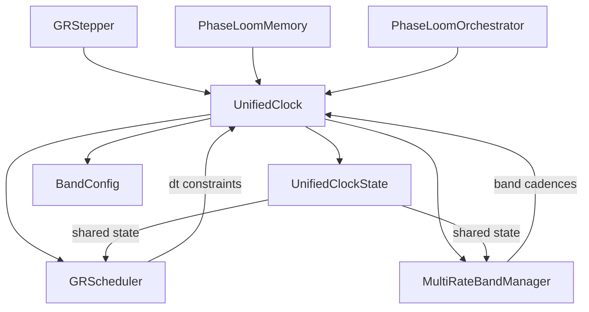

# UnifiedClock Architecture Documentation Summary

**Date:** 2026-01-26
**Module:** [`gr_solver/gr_clock.py`](gr_solver/gr_clock.py)
**Status:** Canon-grade specification

## Overview

The UnifiedClock architecture provides a single source of truth for time state management in the GR solver system. It unifies clock operations previously scattered across multiple components, ensuring consistent time tracking across GRScheduler, MultiRateBandManager, PhaseLoomMemory, and PhaseLoomOrchestrator.

## Core Classes

### UnifiedClockState
- **Location:** [`gr_solver/gr_clock.py:21`](gr_solver/gr_clock.py:21)
- **Purpose:** Shared state container for all clock operations
- **Attributes:**
  - `global_step`: Current step number
  - `global_time`: Current physical time
  - `band_steps`: Per-octave step tracking
  - `band_times`: Per-octave time tracking
- **Methods:**
  - `tick(dt)`: Advance global time
  - `advance_bands(octave, interval)`: Mark band as updated
  - `copy()`: Deep copy for rollback
  - `to_dict()`: Serialize for receipts

### UnifiedClock
- **Location:** [`gr_solver/gr_clock.py:119`](gr_solver/gr_clock.py:119)
- **Purpose:** Main interface for clock operations
- **Key Methods:**
  - `tick(dt)`: Advance clock by one step
  - `get_bands_to_update(dominant_band, amplitude)`: Determine band update mask
  - `compute_dt_constraints(dt_candidate, fields, lambda_val)`: Compute all clock constraints
  - `compute_regime_hash(dt, dominant_band, resolution)`: Detect regime changes
  - `snapshot()`: Serialize state for checkpoint
  - `restore(snapshot)`: Restore from checkpoint

### BandConfig
- **Location:** [`gr_solver/gr_clock.py:70`](gr_solver/gr_clock.py:70)
- **Purpose:** Configuration for per-band update cadences
- **Features:**
  - Octave-based cadence factors (power-of-2)
  - Amplitude thresholds for band culling
  - 8 octaves by default

## Architecture Diagram



## Updated Documentation Files

| File | Changes |
|------|---------|
| [`Technical Data/time_scale_system_canvas.md`](Technical Data/time_scale_system_canvas.md) | Added Level 6 (UnifiedClock), migration notes, architecture diagram, API reference |
| [`Technical Data/temporal_system_contract.md`](Technical Data/temporal_system_contract.md) | Added UnifiedClockState entity, integration examples |
| [`Technical Data/stepper_contract.md`](Technical Data/stepper_contract.md) | Added UnifiedClock interface, updated pseudocode |
| [`plans/gr_solver_build_plan.md`](plans/gr_solver_build_plan.md) | Added gr_clock.py module, updated architecture diagram, UnifiedClock constraints |
| [`plans/comprehensive_gr_solver_system_test_plan.md`](plans/comprehensive_gr_solver_system_test_plan.md) | Added UnifiedClock test scenarios, clock state management tests |

## Key Features

1. **Single Source of Truth**: UnifiedClockState is referenced by all components needing time state
2. **Band-Aware Updates**: Higher octaves update less frequently (power-of-2 cadence factors)
3. **Regime Detection**: Automatic cache invalidation on dt change, residual slope sign change, dominant band change
4. **Snapshot/Restore**: Full state serialization for checkpoint and rollback
5. **Backward Compatibility**: Aliases provided (`ClockState`, `BandClockConfig`)

## Usage Example

```python
from gr_solver.gr_clock import UnifiedClock, UnifiedClockState

# Initialize
clock = UnifiedClock(base_dt=0.001, octaves=8)

# In solver loop
dt_constraints, dt = clock.compute_dt_constraints(dt_candidate, fields, lambda_val)
# ... perform step ...
clock.tick(dt)

# For checkpoint
snapshot = clock.snapshot()

# For rollback
clock.restore(snapshot)
```

## Migration from Aeonic

| Old Pattern | New Pattern |
|-------------|-------------|
| Multiple clock variables | UnifiedClockState single instance |
| Manual time advancement | `clock.tick(dt)` |
| Direct attribute access | `clock.get_state()` |
| Manual state save | `clock.snapshot()` |

## Testing

Run [`tests/test_multi_rate_clocks.py`](tests/test_multi_rate_clocks.py) to verify:
- Clock state advancement
- Band cadence correctness
- Regime detection
- Snapshot/restore operations

## Related Modules

- [`gr_solver/gr_scheduler.py`](gr_solver/gr_scheduler.py): Delegates to UnifiedClock for dt computation
- [`gr_solver/multi_rate_band_manager.py`](gr_solver/multi_rate_band_manager.py): Wraps UnifiedClock for band management
- [`gr_solver/phaseloom_memory.py`](gr_solver/phaseloom_memory.py): Accepts UnifiedClock for triggering

## Compliance Checklist

- [ ] All clock state access goes through UnifiedClock
- [ ] GRScheduler uses `compute_dt_constraints()`
- [ ] MultiRateBandManager uses `get_bands_to_update()`
- [ ] PhaseLoomMemory uses clock for triggering decisions
- [ ] Snapshot/restore implemented for checkpoint/rollback
- [ ] Regime detection triggers cache invalidation
- [ ] Band cadences follow power-of-2 pattern
