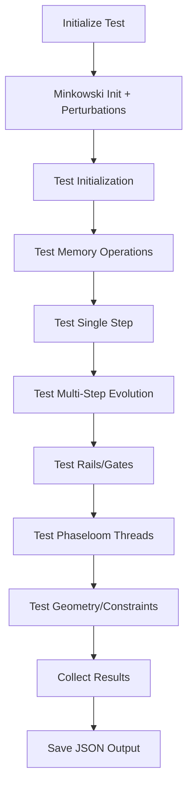

# Comprehensive GR Solver System Function Test Plan

## Objective
Create a standalone, comprehensive system function test that exercises all major functions in the GR solver system, including memory, rails, and gates. The test should initialize the solver with Minkowski spacetime, run key methods (geometry, constraints, stepping, memory operations, rails checks, gate interactions), verify outputs without errors, and handle dependencies properly.

## System Components to Test
Based on the codebase analysis, the following components must be exercised:

1. **GRSolver**: Main solver initialization and orchestration
2. **GRPhaseLoomOrchestrator**: Step execution loop (Sense, Propose, Decide, Commit, Verify, Rail-enforce, Receipt, Render)
3. **GRStepper**: UFE evolution via RK4 stepping
4. **AeonicMemoryBank**: Memory operations, tiers, TTL, maintenance
5. **PhaseLoom27**: Gate system with 27 threads (3 domains × 3 scales × 3 responses)
6. **GRPhaseLoomRails**: Rail enforcement and gate checking
7. **GRGeometry**: Christoffel symbols, Ricci tensor, scalar curvature computations
8. **GRConstraints**: Hamiltonian and momentum constraint calculations
9. **GRGauge**: Lapse and shift evolution
10. **AeonicReceipts**: Event emission and logging

## Test Structure
The test will be implemented as a Python class `ComprehensiveGRSolverTest` with the following methods:

- `__init__`: Setup solver with small grid (e.g., N=16, L=4.0) for fast execution
- `test_initialization`: Initialize with Minkowski and verify fields/geometry
- `test_memory_operations`: Test AeonicMemoryBank put/get/invalidation
- `test_single_step`: Run one orchestrator step and verify all phases
- `test_multi_step_evolution`: Run 10-20 steps to exercise steady-state behavior
- `test_rails_gates`: Verify gate checking and margin computations
- `test_phaseloom_threads`: Test PhaseLoom residual computations and dt arbitration
- `test_constraints_geometry`: Verify finite, reasonable constraint residuals
- `run_all_tests`: Execute test suite and collect results

## Key Test Scenarios
1. **Minkowski Initialization**: Start with flat spacetime + small perturbations to activate Loom
2. **Evolution Steps**: Run multiple time steps to test stability and adaptation
3. **Memory Tier Operations**: Put spectral cache, retrieve, test maintenance eviction
4. **Gate Triggers**: Introduce minor violations to test rail enforcement
5. **Loom Activation**: Ensure PhaseLoom activates for perturbations and updates controls

## Implementation Steps
1. Create `tests/test_comprehensive_gr_solver.py`
2. Implement test class with initialization (Nx=16, Ny=16, Nz=16, L=4.0)
3. Minkowski init with high-k ripple to trigger Loom activity
4. Test each component systematically:
   - Geometry computations (finite, no NaN/Inf)
   - Constraint residuals (finite, decreasing over steps)
   - Memory operations (put/get successful, TTL respected)
   - Rails checks (gates pass initially, handle violations)
   - Phaseloom thread computations (residuals computed, dt arbitrated)
   - Stepper evolution (fields evolve without explosions)
   - Orchestrator phases (all complete without SEM failures)
5. Collect metrics: eps_H/eps_M over steps, memory usage, dominant threads, rail violations
6. Output results to JSON with pass/fail status

## Verification Criteria
- **Initialization**: All fields finite, det(gamma) > 0, alpha > 0
- **Geometry**: Christoffels, Ricci, R computed without errors
- **Constraints**: eps_H, eps_M < 1e-3 initially, remain bounded
- **Memory**: Put operations succeed, get retrieves correctly, maintenance runs
- **Rails**: Gates checked, margins computed, no unhandled violations
- **Phaseloom**: Residuals computed for all 27 threads, dt arbitration works
- **Stepping**: Fields evolve, no NaN/Inf introduced
- **Overall**: No exceptions, test completes in < 5 minutes

## Error Handling and Edge Cases
- Catch and log any exceptions during initialization or stepping
- Check for NaN/Inf in all arrays after each major operation
- Test with different perturbation amplitudes
- Handle potential rail violations gracefully (rollback expected)
- Verify SEM-safe operations don't fail

## Output and Reporting
- Save results to `test_comprehensive_gr_solver_results.json`
- Include: test status, metrics over steps, memory stats, dominant threads, violations
- Print summary to console with pass/fail indicators
- Log any warnings or anomalies for debugging

## Dependencies and Assumptions
- Requires all GR solver modules imported correctly
- Assumes Minkowski initialization works as baseline
- Uses small grid to keep runtime manageable
- Expects some perturbations to remain stable without catastrophic violations

## Mermaid Diagram: Test Flow

This plan ensures comprehensive coverage of all system functions while maintaining test stability and reasonable execution time.