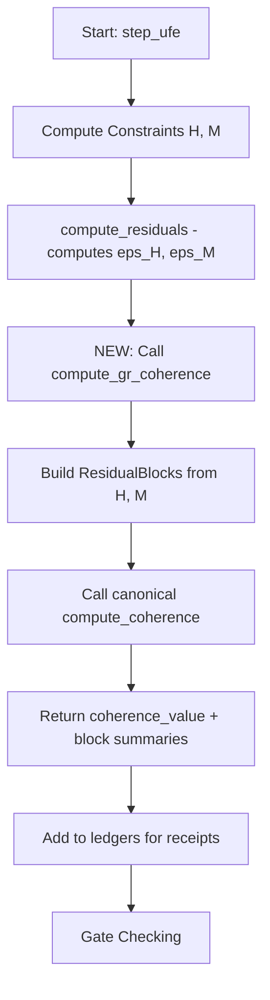

# Defined Coherence Alignment - Surgical Patch Plan

## Executive Summary

This plan addresses the structural misalignments identified between cbtsv1 and the Defined Coherence framework (coherence-framework). The key finding is that while the canonical coherence infrastructure exists in cbtsv1, it is **not integrated into the solver stepper** - the canonical `compute_gr_coherence()` function is never called during simulation.

---

## Current State Assessment

### ✅ What Already Exists (Infrastructure Ready)

1. **Canonical ResidualBlock** - [`src/cbtsv1/vendor/coherence_framework/coherence/core.py:31`](src/cbtsv1/vendor/coherence_framework/coherence/core.py:31)
   - Full implementation with name, vector, scale, weight
   - Lazy-computed properties: dim, l2, linf, hash
   - SHA256 hash of scaled vector bytes

2. **Canonical compute_coherence()** - [`src/cbtsv1/vendor/coherence_framework/coherence/core.py:138`](src/cbtsv1/vendor/coherence_framework/coherence/core.py:138)
   - Implements 𝔠 = ⟨r̃, W r̃⟩ with diagonal covariance model

3. **GR Block Adapter** - [`src/cbtsv1/solvers/gr/defined_coherence_blocks.py:30`](src/cbtsv1/solvers/gr/defined_coherence_blocks.py:30)
   - `build_residual_blocks()` - builds canonical ResidualBlocks from GR constraints
   - `summarize_blocks()` - creates audit-friendly summaries

4. **Coherence Integration Layer** - [`src/cbtsv1/solvers/gr/coherence_integration.py:35`](src/cbtsv1/solvers/gr/coherence_integration.py:35)
   - `compute_gr_coherence()` - single entry point for coherence computation
   - `CoherenceTracker` - tracks coherence history

5. **Configuration** - [`config/defined_coherence_gr.json`](config/defined_coherence_gr.json)
   - Scale and weight configuration for Hamiltonian and Momentum blocks

6. **Tests** - [`tests/test_coherence_alignment.py`](tests/test_coherence_alignment.py)
   - Comprehensive canonical coherence tests
   - GR-specific coherence validation tests

### ❌ What's Missing (Integration Gap)

1. **Solver does NOT call canonical coherence** - The stepper uses legacy `eps_H`, `eps_M` values instead of calling `compute_gr_coherence()`
2. **No coherence value in receipts** - The ledger receipts don't include canonical coherence
3. **Diagnostic norm confusion** - Some `np.linalg.norm()` calls may need explicit diagnostic marking

---

## Surgical Patch Tasks

### Task 1: Integrate Canonical Coherence into Stepper

**File:** [`src/cbtsv1/solvers/gr/gr_stepper.py`](src/cbtsv1/solvers/gr/gr_stepper.py)

**Changes:**
- Import `compute_gr_coherence` from `coherence_integration`
- Load coherence config from `config/defined_coherence_gr.json`
- Call `compute_gr_coherence()` after constraint computation in `step_ufe()`
- Add `coherence_value` to ledgers for receipts

**Location in step_ufe (around line 750-770):**
```python
# After compute_residuals() and before gate checking
from .coherence_integration import compute_gr_coherence

# Load config (once during init, not every step)
# Compute canonical coherence
coherence_result = compute_gr_coherence(
    self.fields, 
    self.constraints, 
    self.coherence_config
)

# Add to ledgers
ledgers['coherence_value'] = coherence_result['coherence_value']
ledgers['coherence_blocks'] = coherence_result['blocks']
```

### Task 2: Mark Diagnostic Norms

**Files to review:**
- [`src/cbtsv1/solvers/gr/gr_stepper.py`](src/cbtsv1/solvers/gr/gr_stepper.py) - rhs_norms (lines 435, 500, 549, 598)
- [`src/cbtsv1/solvers/gr/gr_scheduler.py`](src/cbtsv1/solvers/gr/gr_scheduler.py) - dt calculations
- [`src/cbtsv1/solvers/gr/gr_clocks.py`](src/cbtsv1/solvers/gr/gr_clocks.py) - clock calculations

**Analysis:**
- These norms are for RHS diagnostics and clock calculations
- They are NOT used for coherence computation
- Add comments marking them as `diagnostic_only` for audit clarity

### Task 3: Ensure Block Metadata in Receipts

**File:** [`src/cbtsv1/framework/receipt_schemas.py`](src/cbtsv1/framework/receipt_schemas.py)

**Verify:**
- `MStepReceipt.residual_full` should contain dim, l2, linf, hash, scale, weight per block
- Already implemented in `summarize_blocks()` - needs verification in stepper integration

### Task 4: Create End-to-End Validation Test

**File:** [`tests/test_coherence_full_integration.py`](tests/test_coherence_full_integration.py) (new)

**Test should verify:**
1. Solver stepper calls canonical coherence
2. Coherence value appears in receipts
3. Block metadata is complete (hash present)
4. Coherence decreases for Minkowski (valid) initial data

---

## Implementation Flow



---

## Files to Modify

| File | Change Type | Lines |
|------|------------|-------|
| `src/cbtsv1/solvers/gr/gr_stepper.py` | Import + Integration | ~370, ~750-770 |
| `src/cbtsv1/solvers/gr/gr_solver.py` | Config loading | TBD during implementation |
| `tests/test_coherence_full_integration.py` | New test | N/A |

---

## Files to Review (Diagnostic Marking)

| File | Purpose | Action |
|------|---------|--------|
| `gr_stepper.py` | RHS norms | Add `diagnostic_only` comments |
| `gr_scheduler.py` | Clock dt calculations | Add `diagnostic_only` comments |
| `gr_clocks.py` | Clock computations | Add `diagnostic_only` comments |

---

## Success Criteria

After this patch:

1. ✅ Canonical coherence is computed in every solver step
2. ✅ `coherence_value` appears in step receipts
3. ✅ Block metadata (dim, l2, linf, hash, scale, weight) is logged
4. ✅ No solver-local coherence calculations exist
5. ✅ Diagnostic norms are clearly marked
6. ✅ Test validates end-to-end integration

---

## Risk Assessment

- **Low Risk:** Adding function call to existing workflow
- **No Breaking Changes:** Only adds new data to receipts
- **Performance:** Coherence computation is O(n) like existing residual computation
