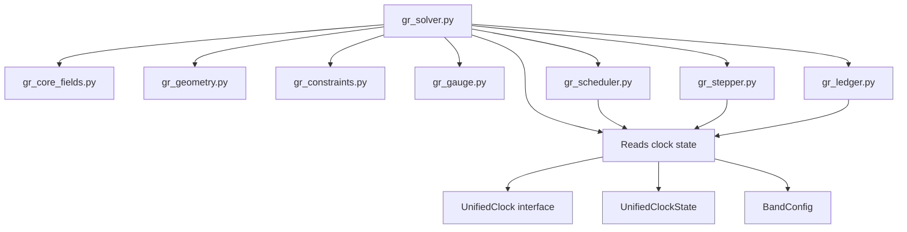

# Detailed Build Plan for Modular GR 3+1 Solver

## Overview
Implement a CPU-safe, modular 3+1 General Relativity solver embedded in the UFE framework, enforcing constraints as first-class objects, using UnifiedClock-based multi-clock time stepping, and emitting Ω-ledger receipts. This builds on the NSE solver architecture for geometric coherence.

**Updated:** Reflects UnifiedClock architecture (`gr_solver/gr_clock.py`)

## Architectural Principles
- **Constraint-Aware**: Constraints measured, logged, and fed back.
- **UFE Embedded**: Direct embedding into UFE canonical form: \(\partial_t \Psi = B(\Psi) + \lambda K(\Psi) + w\).
- **UnifiedClock Scheduling**: Multi-clock timestep selection via [`UnifiedClock`](gr_solver/gr_clock.py:119) with \(\Delta t = \min_k \Delta t_k\) subject to residual bounds.
- **Ledger Verified**: Every step emits auditable receipts with declared observables.
- **CPU-Safe**: NumPy-based, finite differences, no GPU, FFT-free first pass.

## Organization
### Directory Structure
```
gr_solver/
├── __init__.py
├── gr_solver.py          # Main integrator
├── gr_core_fields.py     # Field storage and operations
├── gr_geometry.py        # Geometric tensors (Christoffels, Ricci)
├── gr_constraints.py     # Constraint equations and residuals
├── gr_gauge.py           # Gauge conditions (lapse, shift)
├── gr_clock.py           # UnifiedClock architecture (NEW)
├── gr_scheduler.py       # Scheduler that delegates to UnifiedClock
├── gr_stepper.py         # UFE evolution with damping
└── gr_ledger.py          # Ω-receipt emission
```
Place in `/home/user/cbtsv1/` for consistency with project root.

### Module Interfaces
- Each module is a class with `compute_*` methods.
- Inputs/Outputs: NumPy arrays for fields, scalars for residuals.
- Lexicon declarations at top of each file.
- **UnifiedClock Integration:** GRScheduler and MultiRateBandManager receive UnifiedClock instance.

## Orchestration
The solver orchestrates modules in a loop:
1. **UnifiedClock**: Compute dt constraints from physical clocks (CFL, curvature, constraint, gauge) via [`compute_dt_constraints()`](gr_solver/gr_clock.py:291)
2. **Scheduler**: Delegates to UnifiedClock for dt selection
3. **Stepper**: Evolve \(\Psi\) via UFE: compute B (ADM), K (damping), update fields.
4. **Constraints**: Compute residuals \(\varepsilon_H\), \(\varepsilon_M\).
5. **Ledger**: Log receipts with observables (Q_mass, Q_angular_momentum, residuals).
6. **Check**: If \(\varepsilon > \varepsilon_0\), rollback or halt.
7. **Gauge**: Update lapse/shift if dynamic.
8. **Clock**: Advance unified clock state via [`tick()`](gr_solver/gr_clock.py:174)
9. Repeat until T_max or failure.

## Mathematical Backbone
Using ADM 3+1 decomposition:
\[
ds^2 = -\alpha^2 dt^2 + \gamma_{ij} (dx^i + \beta^i dt)(dx^j + \beta^j dt)
\]
State vector \(\Psi = (\gamma_{ij}, K_{ij})\).

Evolution:
\[
\partial_t \Psi = \mathcal{L}_{ADM}(\Psi) + \lambda \mathcal{K}_{constraint}(\Psi)
\]
With \(\varepsilon_{UFE} = \partial_t \Psi - \mathcal{L}_{ADM} - \lambda \mathcal{K}\) logged.

**UnifiedClock Constraints:** The [`UnifiedClock.compute_dt_constraints()`](gr_solver/gr_clock.py:291) method computes:
- CFL constraint: \(\Delta t_{CFL} = C \min(\Delta x / c)\)
- Curvature constraint: \(\Delta t_{curv} = C \min(1 / |R|)\)
- Constraint clock: \(\Delta t_{constraint} = C / \max(|\partial_t \varepsilon_H|)\)
- Gauge clock: \(\Delta t_{gauge} = C / \max(|\partial_t \alpha|)\)
- Resolution clock: \(\Delta t_{res} = C \cdot h_{\min} / \sqrt{|K|}\)
- Λ-clock: \(\Delta t_{\Lambda} = C \sqrt{3/|\Lambda| c^2}\)

## Module Structure



### gr_clock.py
- **[`UnifiedClockState`](gr_solver/gr_clock.py:21)**: Single source of truth for time state
- **[`UnifiedClock`](gr_solver/gr_clock.py:119)**: Main interface for clock operations
- **[`BandConfig`](gr_solver/gr_clock.py:70)**: Per-band update cadences (octave-based)
- Methods: `tick()`, `get_bands_to_update()`, `compute_dt_constraints()`, `snapshot()`, `restore()`

### gr_core_fields.py
- Storage for \(\gamma_{ij}\), \(K_{ij}\), \(\alpha\), \(\beta^i\) as 3D NumPy arrays.
- Index raising/lowering with metric inverse.
- Initialization: Minkowski (\gamma_{ij} = \delta_{ij}), small perturbations.

### gr_geometry.py
- Christoffel symbols: \(\Gamma^k_{ij} = \frac12 \gamma^{kl} (\partial_i \gamma_{jl} + \partial_j \gamma_{il} - \partial_l \gamma_{ij})\)
- Ricci tensor: \(R_{ij} = \partial_k \Gamma^k_{ij} - \partial_j \Gamma^k_{ik} + \Gamma^k_{ij} \Gamma^l_{kl} - \Gamma^k_{il} \Gamma^l_{kj}\)
- Scalar curvature: \(R = \gamma^{ij} R_{ij}\)
- Finite differences for \(\partial\).

### gr_constraints.py
- Hamiltonian: \(\mathcal{H} = R + K^2 - K_{ij} K^{ij} - 16\pi \rho\)
- Momentum: \(\mathcal{M}^i = \nabla_j (K^{ij} - \gamma^{ij} K) - 8\pi S^i\)
- Residuals: \(\varepsilon_H = \sqrt{\sum (\mathcal{H})^2 \Delta V}\), similarly for \(\varepsilon_M\).

### gr_gauge.py
- Harmonic slicing: \(\partial_t \alpha = -\alpha^2 K\)
- Frozen shift: \(\beta^i = 0\)
- Extensible to 1+log: \(\partial_t \alpha = -2\alpha K\)

### gr_scheduler.py
- Delegates to [`UnifiedClock.compute_dt_constraints()`](gr_solver/gr_clock.py:291) for clock computation
- Selects minimum dt, with rollback if residuals spike
- Receives UnifiedClock instance in constructor

### gr_stepper.py
- Time stepping: RK4 for stability.
- Constraint damping: \(K = -\mu_H \nabla^2 \mathcal{H}\) for Hamiltonian.

### gr_ledger.py
- Emits JSON receipts:
```json
{
  "lexicon_terms_used": ["LoC_axiom", "UFE_core", "GR_dyn"],
  "step": n,
  "dt": Δt,
  "eps_H": ||H||,
  "eps_M": ||M||,
  "eps_UFE": ||ε_UFE||,
  "Q_mass": ADM_mass,
  "Q_angular_momentum": Komar_integral,
  "stability_class": "OK | WARNING | ROLLBACK"
}
```
- Validates schema.

### gr_solver.py
- Integrates all: fields, geometry, etc.
- Run method with loop.

## Lexicon Declarations
Per canon v1.2, each file starts with:
```
imports:
  - LoC_axiom
  - UFE_core
  - GR_dyn
  - CTL_time
symbols:
  \gamma: GR_field.metric
  K: GR_field.extrinsic
  \alpha: GR_gauge.lapse
```

## Implementation Phases
1. **Skeleton Creation**: Stub out all modules with pass.
2. **Core Fields**: Implement storage and basic ops.
3. **Geometry**: Add tensor comps with finite diffs.
4. **Constraints**: Residual calc.
5. **UnifiedClock**: Implement clock architecture with band support.
6. **Scheduler Integration**: Connect scheduler to UnifiedClock.
7. **Gauge & Stepper**: Basic gauge, clock-driven stepping.
8. **Ledger**: Evolution loop, receipts.
9. **Testing**: Minkowski, linear waves, gauge waves.

## Validation Roadmap
- **Phase 1**: Minkowski stability (flat space, no evolution).
- **Phase 2**: Linear GW: plane waves in TT gauge.
- **Phase 3**: Gauge wave: harmonic slicing perturbation.
- **Phase 4**: BH puncture (future).

Require ledger residuals < 1e-6 for pass.

## Dependencies
- NumPy: arrays, linalg.
- JSON: receipts.
- Optional: scipy for sparse solves if needed later.

## Risks & Mitigations
- Blow-ups: Constraint damping and rollback.
- Code bugs: Modular, test each module.
- Performance: CPU ok for first pass, grid N^3.

## Next Steps
- Implement skeleton.
- Add tests.
- Extend to BSSN.
