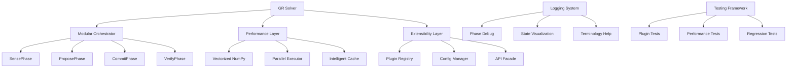

# GR Solver System Improvements Plan

## Overview
This plan addresses the three main challenges in the GR solver system: complexity (debugging challenges and terminology), performance (computational intensity), and extensibility (adding new features). The system has a sophisticated architecture with coherence, phaseloom, memory contracts using NumPy, with comprehensive tests but high computational load for large grids.

## Current System Analysis

### Complexity Issues
- **Architectural Complexity**: 609-line orchestrator with 9 phases (Sense/Propose/Decide/Predict/Commit/Verify/Rail-enforce/Receipt/Render)
- **Terminology Density**: Heavy use of specialized terms (Aeonic, PhaseLoom, UFE, LoC axiom, 27-thread lattice, rails, gates, receipts, etc.)
- **Debugging Challenges**: Long methods with nested conditionals, multiple rollback scenarios, state-dependent vs dt-dependent violations
- **Component Coupling**: Tight integration between phaseloom, memory contracts, aeonic clocks, and receipts

### Performance Issues
- **Computational Hotspots**: Geometry computations (Christoffels, Ricci tensor), constraint residuals, spectral FFTs
- **Memory Scaling**: O(N^3) arrays for 3D fields, multiple temporary arrays per step
- **Sequential Bottlenecks**: Many computations done sequentially despite potential parallelism
- **Cache Inefficiency**: Expensive spectral transforms recomputed even with minimal field changes

### Extensibility Barriers
- **Integration Overhead**: Adding new features requires touching multiple components (threads, receipts, memory, etc.)
- **Configuration Rigidity**: System parameters (thresholds, scales) hardcoded in code
- **Testing Complexity**: Adding new solvers/gauges requires comprehensive integration tests
- **API Limitations**: No plugin architecture or extension points

## Improvement Strategies

### 1. Complexity Reduction (Priority: High, Feasibility: Medium)

#### Modular Orchestrator Refactoring
**Approach**: Break the 609-line `GRPhaseLoomOrchestrator.run_step()` into smaller, single-responsibility classes:
- `SensePhase`: Handle diagnostics and residual computation
- `ProposePhase`: Thread dt proposals and arbitration
- `DecidePhase`: Dt selection with hysteresis
- `CommitPhase`: State evolution with rollback
- `VerifyPhase`: Post-step validation
- `EnforcePhase`: Rail enforcement and repairs

**Implementation**:
1. Create phase base class with `execute()` method
2. Each phase receives orchestrator state and returns updated state
3. Use composition pattern: `orchestrator.run_step() -> [phase.execute() for phase in phases]`

**Benefits**: Easier debugging, testable phases, clearer control flow

#### Enhanced Logging and Visualization
**Approach**: Add configurable logging levels and state visualization:
- Step-by-step debug output with phase timing
- State snapshots (fields, residuals, threads) at key points
- Mermaid diagram generation for thread dominance chains
- Web-based visualization for field evolution (optional)

**Implementation**:
1. Add `logging_config` parameter to orchestrator
2. Implement `StateSnapshot` class for serialization
3. Create `DebugRenderer` for ASCII/visual output

#### Terminology Documentation
**Approach**: Create comprehensive lexicon documentation:
- Master glossary with definitions and examples
- Code annotations linking to lexicon terms
- Interactive help system in Python prompt
- Onboarding guides for new developers

**Implementation**:
1. Extract lexicon symbols into `gr_lexicon.py`
2. Add docstring cross-references
3. Create `help()` methods for classes

### 2. Performance Optimization (Priority: High, Feasibility: High)

#### NumPy Optimization
**Approach**: Vectorize operations and reduce memory allocations:
- Use in-place operations where possible
- Pre-allocate temporary arrays
- Leverage NumPy broadcasting for tensor operations
- Replace Python loops with array operations

**Implementation**:
1. Profile current code with `cProfile`
2. Identify hotspots in geometry/constraints
3. Rewrite critical sections using `@numba.jit` for CPU acceleration

#### Parallel Computation Support
**Approach**: Parallelize independent computations:
- Geometry (Christoffels/Ricci) and constraints can run concurrently
- Spectral transforms can be parallelized across k-bins
- Thread proposals can be computed in parallel

**Implementation**:
1. Add `concurrent.futures` integration
2. Split `run_step()` into parallelizable tasks
3. Use `multiprocessing.Pool` for CPU-bound operations

#### Intelligent Caching
**Approach**: Cache expensive computations based on change detection:
- Spectral cache already exists but could be more aggressive
- Geometry tensors cached when metric changes < threshold
- Constraint residuals cached across small dt steps

**Implementation**:
1. Extend `SpectralCache` with change-based invalidation
2. Add `GeometryCache` with delta tracking
3. Implement cache hit/miss metrics

#### Memory Optimization
**Approach**: Reduce memory footprint for large grids:
- Use memory-mapped arrays for large fields
- Implement out-of-core processing for spectral operations
- Add grid partitioning for distributed computation

**Implementation**:
1. Add `memory_efficient` mode flag
2. Use `numpy.memmap` for field storage
3. Implement tiled processing for constraints

### 3. Extensibility Improvements (Priority: Medium, Feasibility: High)

#### Plugin Architecture
**Approach**: Create extension points for new features:
- Solver plugins (ADM, BSSN variants)
- Gauge condition plugins (harmonic, 1+log, frozen shift)
- Constraint enforcer plugins
- Thread plugins for custom PhaseLoom threads

**Implementation**:
1. Define plugin interfaces in `gr_solver.plugins`
2. Use entry points for dynamic loading
3. Add plugin registry and validation

#### Configuration System
**Approach**: External configuration for system parameters:
- JSON/YAML config files for thresholds, scales, policies
- Runtime parameter adjustment
- Preset configurations for different use cases

**Implementation**:
1. Create `GRConfig` class with validation
2. Add `--config` CLI option to solver
3. Implement config hot-reloading

#### Simplified API Layer
**Approach**: Provide high-level interfaces for common tasks:
- `SimpleGRSolver` for basic evolution
- `BenchmarkSolver` for performance testing
- `DebugSolver` with enhanced diagnostics

**Implementation**:
1. Create facade classes wrapping full orchestrator
2. Add convenience methods for common setups
3. Implement presets for standard scenarios

#### Integration Testing Framework
**Approach**: Automated testing for extensions:
- Plugin compatibility tests
- Regression tests for new features
- Performance regression detection

**Implementation**:
1. Extend `test_comprehensive_gr_solver.py` with plugin tests
2. Add `pytest` fixtures for common setups
3. Implement performance baselines

## Implementation Priority and Phasing

### Phase 1: Core Complexity Reduction (Weeks 1-2)
1. Modular orchestrator refactoring
2. Enhanced logging system
3. Basic terminology documentation

### Phase 2: Performance Optimization (Weeks 3-4)
1. NumPy vectorization improvements
2. Intelligent caching implementation
3. Parallel computation support

### Phase 3: Extensibility Foundation (Weeks 5-6)
1. Plugin architecture skeleton
2. Configuration system
3. Integration testing framework

### Phase 4: Advanced Features (Weeks 7-8)
1. Memory optimization for large grids
2. Web visualization (optional)
3. Performance monitoring dashboard

## Success Metrics

### Complexity Metrics
- Orchestrator method length reduced by 70%
- Debug time for new issues reduced by 50%
- New developer onboarding time < 2 days

### Performance Metrics
- 3x speedup on large grids (N=128)
- Memory usage reduced by 40% for large simulations
- Spectral computations cached 80% of the time

### Extensibility Metrics
- New solver plugin integration time < 1 day
- Configuration changes without code modification
- Plugin ecosystem with 3+ community contributions

## Risk Mitigation

### Technical Risks
- **Performance Regression**: Implement comprehensive benchmarking suite
- **Breaking Changes**: Gradual migration with backward compatibility
- **Memory Leaks**: Add memory profiling and leak detection

### Organizational Risks
- **Learning Curve**: Provide training materials and examples
- **Maintenance Burden**: Automate testing and documentation updates
- **Scope Creep**: Strict feature gating and phased rollout

## Mermaid Diagram: System Architecture Improvements

This plan provides a systematic approach to addressing the system's challenges while maintaining scientific accuracy and system reliability.