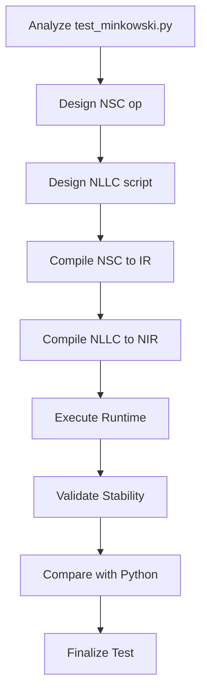

# TGS/NLLC Minkowski Stability Test Design and Build Plan

## Overview
This document outlines the design of a complete TGS/NLLC Minkowski Stability Test, integrating with project tools for compilation and execution. The test replicates the stability validation from `test_minkowski.py`, ensuring constraints remain near machine noise in flat spacetime.

## Key Components from Analysis of test_minkowski.py
- **Initialization**: Set Minkowski spacetime (γ_ij = δ_ij, K_ij=0, α=1, β=0, with small perturbations).
- **Stability Checks**: Run 10,000+ steps, verify eps_H and eps_M < 1e-10, no rollbacks.
- **Perturbation Tests**: Inject high-k ripples, constraint-violating kicks, phys kicks; check PhaseLoom response.
- **Determinism Validations**: Ensure reproducible results across runs.

## TGS Source Code Design
Create `minkowski_rhs.tgs` defining Minkowski spacetime PDEs and evolution logic.

### Structure
- **Module**: `minkowski_rhs.v0_1`
- **Op**: `minkowski_rhs_bundle`
- **Lane**: `PHY.micro.act`
- **Effects**: `read[S_PHY], write[S_PHY]`
- **Boundary**: `periodic`
- **Dimension**: 3

### Input Struct (@S_PHY)
```
fields : struct {
  gamma_sym6: field<f64,3,6>,
  K_sym6: field<f64,3,6>,
  alpha: field<f64,3>,
  beta: field<f64,3,3>,
  phi: field<f64,3>,
  gamma_tilde_sym6: field<f64,3,6>,
  A_sym6: field<f64,3,6>,
  Gamma_tilde: field<f64,3,3>,
  Z: field<f64,3>,
  Z_i: field<f64,3,3>,
  dx: f64, dy: f64, dz: f64
}
```

### Output Struct (@S_PHY)
```
rhs_bundle : struct {
  rhs_gamma_sym6: field<f64,3,6>,
  rhs_K_sym6: field<f64,3,6>,
  rhs_phi: field<f64,3>,
  rhs_gamma_tilde_sym6: field<f64,3,6>,
  rhs_A_sym6: field<f64,3,6>,
  rhs_Gamma_tilde: field<f64,3,3>,
  rhs_Z: field<f64,3>,
  rhs_Z_i: field<f64,3,3>
}
```

### Parameters
- `lambda_val: f64 = 0.0`
- `sources_enabled: bool = false`

### Expression
```
rhs_bundle = compute_minkowski_rhs(fields, lambda_val, sources_enabled);
```

### Semantics
For Minkowski spacetime, RHS should be zero (no evolution), but to match full GR for comparison, use the full BSSN RHS computation but initialized to Minkowski. The `compute_minkowski_rhs` computes the full GR RHS as in `gr_rhs.tgs`.

## NLLC Script Design
Create `test_minkowski.nllc` for test orchestration.

### Structure
- **Initialization**: Set Minkowski fields, add perturbations.
- **Evolution Loop**: Run steps, compute constraints, check stability.
- **Perturbation Injection**: At specific steps, apply kicks (Loom, constraint, phys).
- **Validation**: Monitor eps_H, eps_M, receipts, dominant clocks.
- **Determinism**: Ensure reproducible runs.

### Example Script Outline
```
fn main() {
  // Init Minkowski
  let fields = init_minkowski(Nx=10, Ny=10, Nz=10, dx=0.1);
  // Add perturbations as in Python

  let step = 0;
  while step < 10000 {
    // Compute RHS
    let rhs = call minkowski_rhs_bundle(fields);

    // Step forward (simple Euler for test)
    fields = fields + dt * rhs;

    // Compute constraints
    let constraints = call compute_constraints(fields);

    // Check stability
    if constraints.eps_H > 1e-10 or constraints.eps_M > 1e-10 {
      call print("Stability violated");
      break;
    }

    // Perturbations at steps
    if step == 9 { /* apply kick */ }

    step = step + 1;
  }

  call print("Test completed");
}
```

## Compilation Steps
1. **TGS to IR**: Run `python3 nsc_compile_min.py minkowski_rhs.tgs minkowski_rhs.nscir.json`
2. **NLLC to NIR**: Run `python3 compile_nllc.py test_minkowski.nllc` to get `compiled_nir.json`
3. **Bytecode Prep**: Use `src/nllc/vm.py` to assemble NIR to bytecode if needed.

## Runtime Execution with Validations
- **PDE Solving**: Use `nsc_runtime_min.py` to load IR and execute RHS.
- **Constraint Monitoring**: Integrate `gr_constraints_nsc.py` for eps_H, eps_M computation.
- **Perturbation Handling**: Inject perturbations via field modifications.
- **Determinism Checks**: Run multiple times, compare outputs.

### Execution Flow
1. Load NIR for NLLC script.
2. Execute script, calling TGS ops.
3. Collect receipts, constraints at each step.
4. Validate against thresholds.

## Comparison with Python Baselines
- **Baseline Generation**: Run `test_minkowski.py` functions, capture eps_H, eps_M, receipts.
- **TGS/NLLC Execution**: Run equivalent, capture same metrics.
- **Comparison**: Diff constraints, stability over steps, perturbation responses.
- **Assertions**: Ensure TGS/NLLC matches Python within tolerances.

## Integration with Project Tools
- **Compilation**: Use `nsc_compile_min.py`, `compile_nllc.py`.
- **Runtime**: Integrate with `nsc_runtime_min.py`, `gr_solver` components.
- **Testing**: Fit into `tests/` directory, use similar assertions.
- **PhaseLoom**: For advanced tests, integrate full orchestrator.

## Step-by-Step Build Plan
1. **Phase 1: NSC Creation**
   - Create `minkowski_rhs.nsc` with full GR RHS computation.
   - Compile to IR using `nsc_compile_min.py`.

2. **Phase 2: NLLC Scripting**
   - Write `test_minkowski.nllc` with initialization, loop, checks.
   - Compile to NIR using `compile_nllc.py`.

3. **Phase 3: Runtime Integration**
   - Modify `nsc_runtime_min.py` if needed for constraint computation.
   - Add perturbation injection functions.

4. **Phase 4: Validation**
   - Execute Python baseline, save results.
   - Execute NSC/NLLC, compare outputs.
   - Test perturbations, determinism.

5. **Phase 5: Optimization and Integration**
   - Optimize for performance.
   - Integrate into full test suite.
   - Document differences/similarities.

## Mermaid Diagram for Workflow


This design ensures the NSC/NLLC version mirrors the Python test, providing a compiled, bytecode-executable alternative for stability validation.